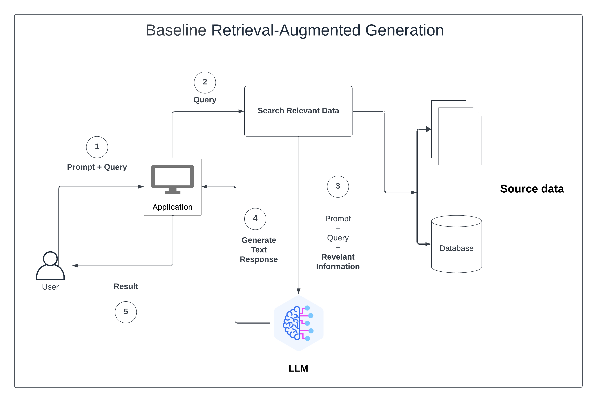

# GraphRAG
GraphRAG is a structured, hierarchical approach to Retrieval Augmented Generation (RAG), as opposed to naive semantic-search approaches using plain text snippets.

## Baseline Retrieval Augmented Generation (RAG)

